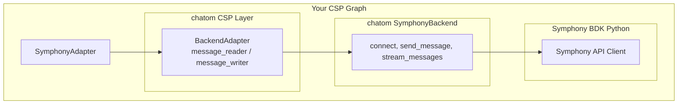

# csp-adapter-symphony

A [CSP](https://github.com/point72/csp) adapter for [Symphony](https://symphony.com) that wraps [chatom's](https://github.com/1kbgz/chatom) SymphonyBackend.

This adapter provides real-time message streaming and processing for Symphony using CSP's reactive programming model, powered by chatom for all Symphony operations.

[](https://github.com/Point72/csp-adapter-symphony/actions/workflows/build.yaml)
[](https://codecov.io/gh/Point72/csp-adapter-symphony)
[](https://github.com/Point72/csp-adapter-symphony)
[](https://pypi.python.org/pypi/csp-adapter-symphony)

## Features

- **Chatom-Powered**: Uses chatom's SymphonyBackend for all Symphony operations
- **Real-Time Streaming**: Subscribe to messages via Symphony's datafeed
- **Message Publishing**: Send messages to rooms and direct messages
- **Presence Management**: Set bot presence status
- **Mention Utilities**: Easy @mention formatting with chatom's mention functions
- **Type Safety**: Full type annotations with Pydantic models

## Architecture



## Quick Start

### Installation

```bash
pip install csp csp-adapter-symphony
```

### Basic Example

```python
from datetime import datetime, timedelta

import csp
from csp import ts

from chatom.symphony import SymphonyConfig
from csp_adapter_symphony import SymphonyAdapter, SymphonyMessage


# Configure using chatom's SymphonyConfig
config = SymphonyConfig(
    host="company.symphony.com",
    bot_username="my-bot",
    bot_private_key_path="/path/to/private-key.pem",
)


@csp.node
def echo_messages(messages: ts[[SymphonyMessage]]) -> ts[SymphonyMessage]:
    """Echo incoming messages back."""
    if csp.ticked(messages):
        for msg in messages:
            if "hello" in msg.content.lower():
                return SymphonyMessage(
                    channel_id=msg.channel_id,  # Use generic field
                    content=f"Hello, {msg.author_id}!",
                )


@csp.graph
def my_bot():
    adapter = SymphonyAdapter(config)

    # Subscribe to all messages
    messages = adapter.subscribe()

    # Process messages
    responses = echo_messages(messages)

    # Publish responses
    adapter.publish(responses)


if __name__ == "__main__":
    csp.run(my_bot, starttime=datetime.now(), endtime=timedelta(hours=8), realtime=True)
```

### Filtering by Room

```python
@csp.graph
def my_bot():
    adapter = SymphonyAdapter(config)

    # Subscribe to specific rooms by name or ID
    messages = adapter.subscribe(rooms={"Bot Room", "Support"})
    messages = adapter.subscribe(rooms={"stream123", "stream456"})

    # Process...
```

### Presence Management

```python
from csp_adapter_symphony import SymphonyPresenceStatus

@csp.graph
def my_bot():
    adapter = SymphonyAdapter(config)

    # Set presence to available
    presence = csp.const(SymphonyPresenceStatus.AVAILABLE)
    adapter.publish_presence(presence)
```

### Using Mentions

```python
from csp_adapter_symphony import mention_user_by_uid, mention_user_by_email, format_hashtag

# Mention by user ID
msg_content = f"Hello {mention_user_by_uid(12345)}!"

# Mention by email
msg_content = f"Hello {mention_user_by_email('user@example.com')}!"

# Check if message mentions a user
if incoming_msg.mentions_user("12345"):
    # Handle mention...

# Use hashtags
msg_content = f"Check out {format_hashtag('important')}!"
```

## Configuration

### Using SymphonyConfig (Recommended)

Use chatom's `SymphonyConfig` directly:

```python
from chatom.symphony import SymphonyConfig

config = SymphonyConfig(
    host="company.symphony.com",
    bot_username="my-bot",
    bot_private_key_path="/path/to/private-key.pem",
)
adapter = SymphonyAdapter(config)
```

### Using SymphonyAdapterConfig

For adapter-specific options (error handling, retries):

```python
from csp_adapter_symphony import SymphonyAdapterConfig

config = SymphonyAdapterConfig(
    host="company.symphony.com",
    bot_username="my-bot",
    bot_private_key_path="/path/to/private-key.pem",
    # Adapter-specific options:
    error_room="Error Notifications",
    inform_client=True,
    max_attempts=5,
)
```

### Certificate-Based Authentication

```python
config = SymphonyConfig(
    host="company.symphony.com",
    bot_username="my-bot@domain.com",
    bot_certificate_path="/path/to/combined.pem",
)
```

## API Reference

### SymphonyAdapter

The main adapter class that wraps chatom's SymphonyBackend.

```python
class SymphonyAdapter:
    def __init__(self, config: SymphonyConfig): ...

    def subscribe(
        self,
        room_names: Optional[Set[str]] = None,
        room_ids: Optional[Set[str]] = None,
        skip_own: bool = True,
        skip_history: bool = True,
    ) -> ts[[SymphonyMessage]]: ...

    def publish(self, msg: ts[SymphonyMessage]): ...

    def publish_presence(self, presence: ts[SymphonyPresenceStatus], timeout: float = 5.0): ...
```

### SymphonyMessage (from chatom)

Pydantic model for Symphony messages:

```python
class SymphonyMessage(Message):
    channel_id: str = ""  # Generic field (inherited) - USE THIS
    stream_id: str = ""   # Symphony-specific alias
    content: str = ""
    author_id: str = ""
    mentions: List[int] = []
    message_ml: str = ""
    # ... and more

    def mentions_user(self, user_id: str) -> bool: ...

    @staticmethod
    def extract_mentions_from_data(data: str) -> List[int]: ...
```

**Note:** Use `channel_id` (the generic field) for backend-agnostic code.

### SymphonyPresenceStatus (from chatom)

Enum for presence status:

```python
class SymphonyPresenceStatus(Enum):
    AVAILABLE = "available"
    BUSY = "busy"
    AWAY = "away"
    ON_THE_PHONE = "on_the_phone"
    BE_RIGHT_BACK = "be_right_back"
    IN_A_MEETING = "in_a_meeting"
    OUT_OF_OFFICE = "out_of_office"
    OFF_WORK = "off_work"
```

## Using chatom CSP Layer Directly

You can also use chatom's generic CSP layer with any backend:

```python
from chatom.csp import BackendAdapter, message_reader, message_writer
from chatom.symphony import SymphonyBackend, SymphonyConfig

# Create backend
config = SymphonyConfig(host="company.symphony.com", ...)
backend = SymphonyBackend(config=config)

# Use generic adapter
adapter = BackendAdapter(backend)

@csp.graph
def my_graph():
    messages = adapter.subscribe()
    # ... process ...
    adapter.publish(responses)
```

## Related Projects

- [chatom](https://github.com/Point72/chatom) - Unified chat platform abstraction
- [csp](https://github.com/Point72/csp) - Reactive programming library
- [csp-bot](https://github.com/Point72/csp-bot) - Cross-platform chat bot framework

## License

Apache 2.0
